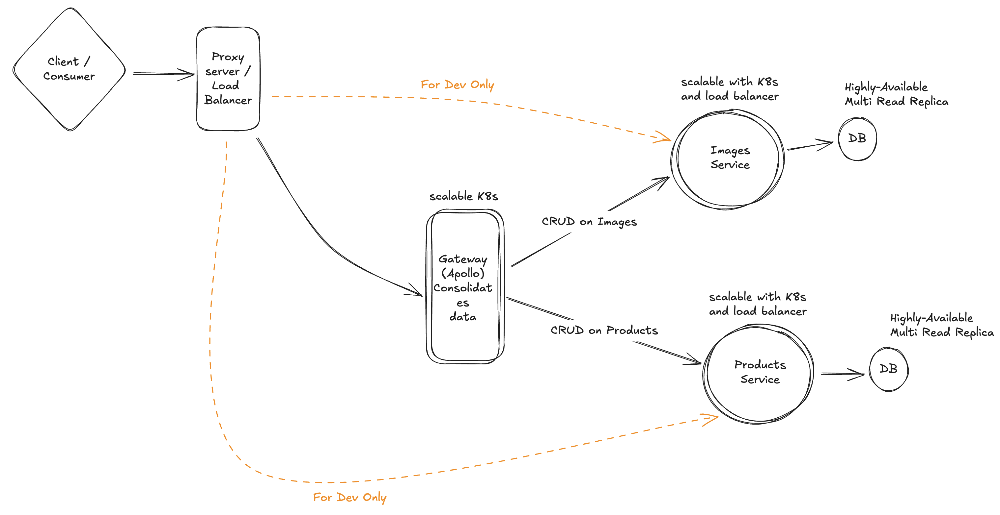

# Federated GraphQL APIs

This repository contains two federated GraphQL services implemented with [Strawberry](https://strawberry.rocks/): the **Image Service** and the **Product Service**. These services are designed to work with Apollo Federation 2 to form a distributed GraphQL API.


### Functional Requirements

- Clients should be able to perform CRUD actions on products
- Clients should be able to perform CRUD actions on Images
- Each Product can have one or multiple images
- Clients can communicate with Graphql

### Non-Functional Requirements
- CAP theorem ( availability >> consistency ) - ending up with images which don't have actual product associated to them is acceptable
- Low latency - users are querying db heavily -> read >> wire
- Massive current requests --> async approach
- Scalability ( Horizontally scalable )

### Out Of Scope
- Storing actual image into a blob storage like Minio or S3
- Security (authentication and authorization)
- Caching
- Database replication

### System Design ( out of scope partially )

What is provided is a monorepo with a reverse proxy (Nginx), in real world scenarios, technologies can be different



## How to use backend ?

Clone the project

```bash
  git clone git@github.com:alirezakhosraviyan/graphql-sample.git
```

Get into project folder

```bash
  cd graphql-sample
```

Run the project (assuming you `localhost:81` is **not** already in use)

```bash
  docker-compose up -d
```

Access the project on:
- Gateway : [http://localhost:81](http://localhost:81)
- (Dev Only) Products Service: [http://localhost:81/products/graphql](http://localhost:81/products/graphql)
- (Dev Only) Images Service: [http://localhost:81/images/graphql](http://localhost:81/images/graphql)

(Optional) Clean up

```bash
  docker-compose down -v
```

# Technical Notes

- **`AsyncIO`** : Since the code is mostly IO-bound and not CPU-bound, using async programming helps the code be faster and more responsive.

- **`Sqlmodel`** : Helps code reusability, supported by fastapi, on top of SQLAlchemy, supports async programming, validation with pydantic

- **`Ruff`** : An extremely fast Python linter and code formatter, written in Rust, ( instead of : pylint, black, isort, etc)

- **`tests`** : Backend has enough tests to cover all APIs to showcase my skill in creating tests but surely for production ready products we can always have more tests

- **`Github-CI`** : Checks the code quality and tests automatically to ensure the delivery of high-quality code.

## Tech Stack

**Server:** Python, Fastapi, Strawberry, Graphql, Postgresql, Sqlmodel, Pydantic, Alembic, JWT, Asyncio, Pytest, Ruff (all linters), MyPy, Docker, Docker-Compose, github-actions


